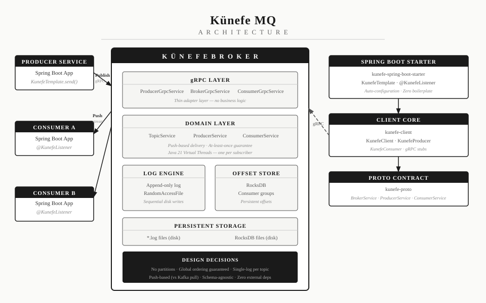

<p align="center">
  
</p>

<p align="center">
  <a href="https://github.com/selimsahindev/kunefe-mq/actions/workflows/build.yml">
    
  </a>
  
  
  
  
</p>

## Kunefe MQ

A lightweight, low-latency gRPC-based message broker for microservices. Built as a leaner alternative to Kafka.

> ***Künefe** (pronounced /ˌkuːnəˈfeɪ/) is a traditional Turkish dessert known for its layered structure. Just like the dessert, Kunefe MQ is built in layers — each one doing exactly what it should.*

---

## Why Kunefe?

Kafka is a powerful system, but it comes with significant operational overhead — ZooKeeper or KRaft, multiple brokers, Schema Registry, complex configuration. For small-to-medium microservice architectures, this is often overkill.

Kunefe MQ makes a different set of trade-offs:

| | Kafka | Kunefe                        |
|---|---|-------------------------------|
| **Consumption model** | Pull-based | Push-based (server streaming) |
| **Ordering** | Per-partition | Global, always guaranteed     |
| **Partitioning** | Yes | No — intentionally omitted    |
| **Dependencies** | ZooKeeper / KRaft | None                          |
| **Deployment** | Multiple processes | Single Docker container       |
| **Throughput** | Millions of msg/sec | Thousands of msg/sec          |
| **Target** | Large-scale systems | Small-to-medium microservices |

Kunefe optimizes for **low latency** and **developer experience** over raw throughput.

---

## Architecture



### Key Design Decisions

- **Push-based consumption** — broker pushes messages to subscribers over a long-lived gRPC server-streaming connection. No polling, no `linger.ms`.
- **Append-only log** — messages are written sequentially to disk using `RandomAccessFile`. Immutable, durable, and fast.
- **Persistent offsets** — consumer group offsets are stored in RocksDB. Broker restarts do not cause message loss or redelivery.
- **Java 21 Virtual Threads** — each subscriber runs on a dedicated virtual thread. Thousands of concurrent consumers with zero platform thread exhaustion.
- **Global ordering** — no partitions means no partition-key complexity. Message order is always guaranteed within a topic.

---

## Getting Started

### Run with Docker

```bash
docker run -p 6565:6565 selimsahindev/kunefe-broker:latest
```

### Run with Docker Compose

```bash
docker compose up
```

Broker starts on port `6565` (gRPC).

---

## Usage

### Add the dependency

```kotlin
// build.gradle.kts
implementation("dev.selimsahin.kunefe:kunefe-spring-boot-starter:0.1.0")
```

### Configure

```yaml
# application.yml
kunefe:
  broker:
    host: localhost
    port: 6565
```

### Publish a message

```java
@Autowired
private KunefeTemplate kunefeTemplate;

public void placeOrder(Order order) {
    kunefeTemplate.send("orders", objectMapper.writeValueAsBytes(order));
}
```

### Consume messages

```java
@KunefeListener(topic = "orders", group = "order-service")
public void onOrder(byte[] payload) {
    Order order = objectMapper.readValue(payload, Order.class);
    // process order
}
```

---

## Module Structure

```
kunefe/
├── kunefe-proto/              # Protobuf contracts         — BrokerService, ProducerService, ConsumerService
├── kunefe-broker/             # Broker application         — log engine, gRPC services, offset store
├── kunefe-client/             # Core Java client           — KunefeClient, KunefeProducer, KunefeConsumer
├── kunefe-spring-client/      # Spring integration layer
├── kunefe-spring-boot-starter # Auto-configuration         — KunefeTemplate, @KunefeListener
└── kunefe-test/               # Integration tests
```

---

## Building from Source

```bash
git clone https://github.com/selimsahindev/kunefe-mq.git
cd kunefe-mq
./gradlew build
```

Run the broker:

```bash
./gradlew :kunefe-broker:bootRun
```

Run tests:

```bash
./gradlew test
```

---

## License

MIT